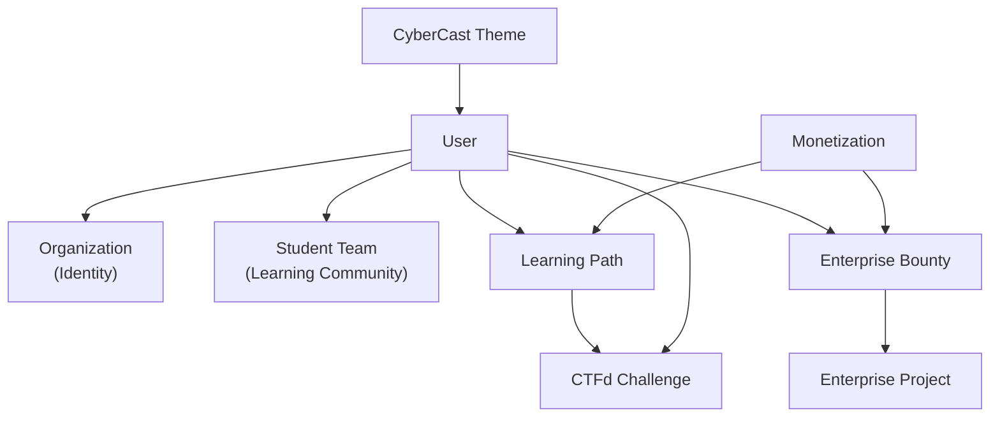
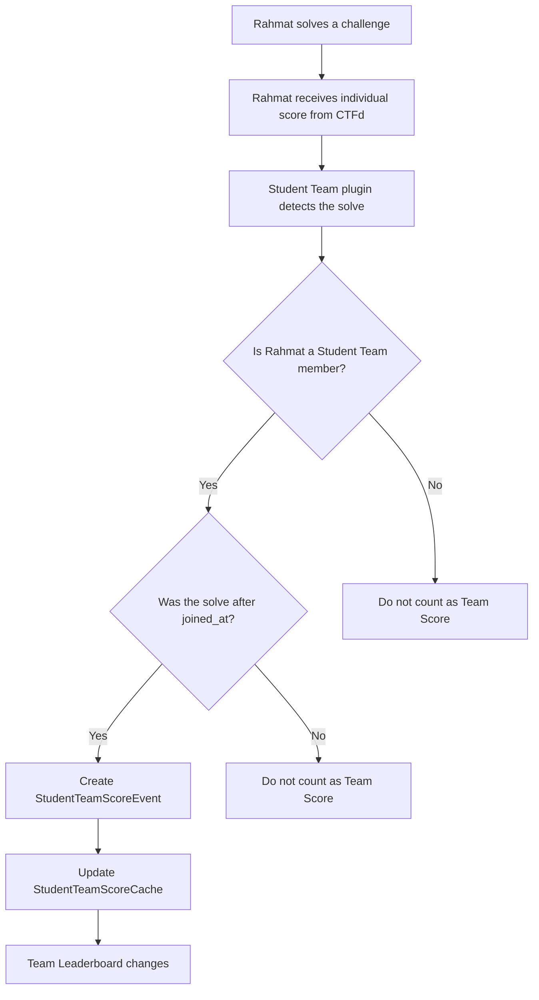
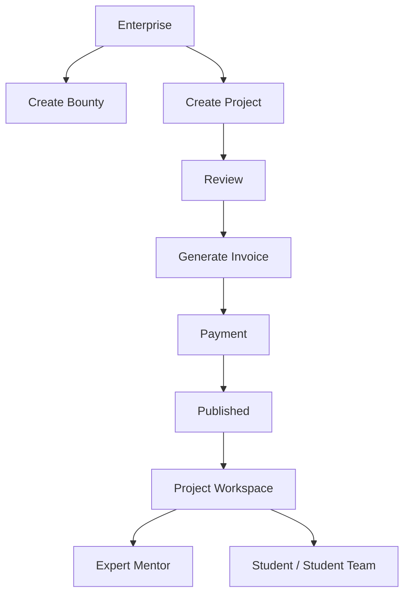
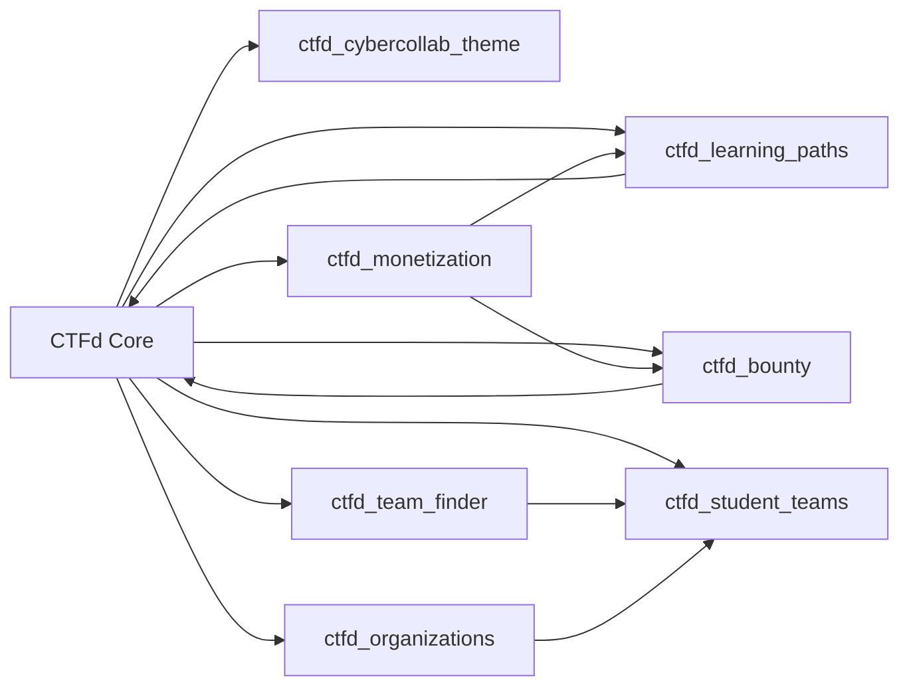
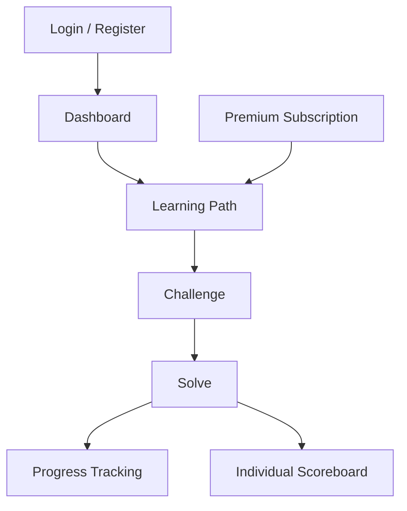
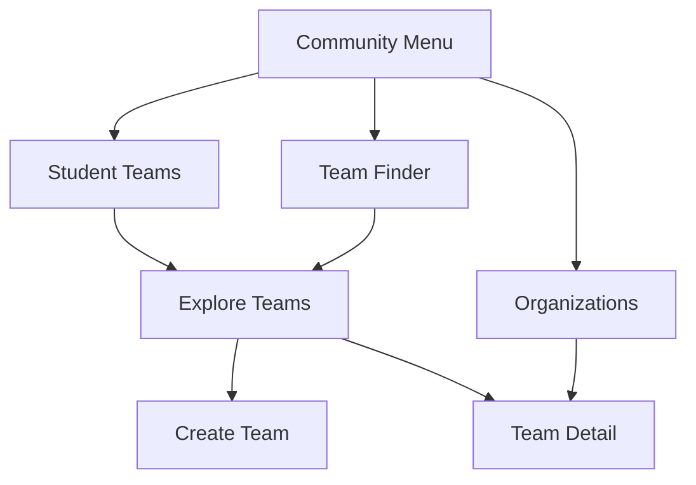
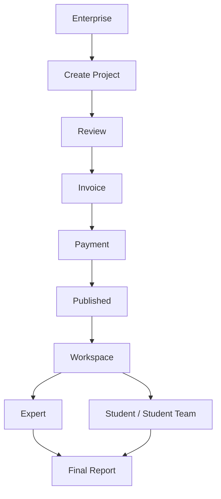

# CyberCast Architecture

This document is written for new developers joining the CyberCast project, especially developers who will work on the **Expert** and **Enterprise** interfaces.

CyberCast is built on top of **CTFd**. CTFd remains the core engine for users, challenges, flags, solves, and the individual scoreboard. CyberCast adds its own plugins on top of CTFd to create a broader cybersecurity learning platform.

The main goal of CyberCast is to combine:

- individual learning,
- challenge solving and progress tracking,
- learning communities,
- enterprise bounty/project workflows,
- monetization,
- and collaboration between Students, Experts, Enterprises, and Admins.

The core principle is: **CTFd stays as the Challenge Engine, while CyberCast adds the experience layer through plugins.**

---

## 1. CyberCast Overview

CyberCast is not only a traditional CTF platform. It is a cybersecurity learning platform that uses CTFd as its technical foundation.

Main CyberCast features:

- Learning Path
- Challenge
- Progress Tracking
- Enterprise Bounty
- Organization
- Student Team
- Team Finder
- Monetization
- Expert and Enterprise workflows

CTFd still handles:

- user accounts,
- challenges,
- flag submissions,
- solves,
- individual score,
- individual scoreboard.

CyberCast adds:

- learning paths,
- community layer,
- student teams,
- enterprise projects,
- billing/subscription,
- custom theme and UX.

---

## 2. Plugin Architecture

CyberCast features should be implemented as plugins whenever possible. Avoid changing CTFd core if the feature can be built through a plugin.

| Plugin | Responsibility |
|---|---|
| `ctfd_learning_paths` | Manages learning paths, lessons/modules, learning progress, and premium learning access. |
| `ctfd_bounty` | Manages Enterprise bounty/project boards, student submissions, reviews, and payment gating before publishing. |
| `ctfd_organizations` | Manages organization identity, such as universities, companies, and communities. |
| `ctfd_team_finder` | Provides discovery for finding teammates or finding Student Teams. |
| `ctfd_student_teams` | Manages Student Teams as permanent CyberCast learning communities. |
| `ctfd_monetization` | Manages subscriptions, invoices, payment abstraction, billing history, and admin payment dashboards. |
| `ctfd_cybercollab_theme` | Manages the CyberCast interface, navbar, footer, auth pages, challenge UI, and main styling. |

### Important Note

`ctfd_student_teams` is the main team system for CyberCast. It is different from CTFd built-in Teams.

CTFd built-in Teams are not deleted, but they are not the main CyberCast UI.

---

## 3. Plugin Relationships

A simplified view of CyberCast plugin relationships:



Short explanation:

- A User can have an Organization as identity.
- A User can join a Student Team.
- A User completes Learning Paths and Challenges individually.
- Bounty and Enterprise Project workflows provide collaboration with Enterprise users.
- Monetization controls premium access and payment flows.
- Theme controls the user experience so CyberCast does not feel like default CTFd.

---

## 4. User Architecture

CyberCast has several user roles.

| Role | Main Purpose | Example Access |
|---|---|---|
| Student | Learn, solve challenges, follow learning paths, join Student Teams, apply to projects. | Challenge, Learning Path, Student Team, Bounty, Subscription. |
| Expert | Create and validate content/projects, mentor students. | Learning Path, Challenge, project validation, mentor workspace. |
| Enterprise | Create bounty/project opportunities and collaborate with students/experts. | Bounty, Project, Invoice, Workspace. |
| Admin | Manage the platform. | Admin dashboard, monetization, invoices, subscriptions, content management. |

### Student

Students are the primary users of the platform. Students can:

- solve challenges individually,
- follow learning paths,
- view personal progress,
- join Student Teams,
- participate in the individual leaderboard,
- apply to bounties or enterprise projects,
- upgrade to Premium for premium learning path access.

### Expert

Experts are responsible for content and project quality. Experts can:

- create Learning Paths,
- create Challenges,
- validate Projects,
- mentor students,
- help review final reports.

### Enterprise

Enterprise users are external parties that create bounties or projects. Enterprise users can:

- create bounties,
- create projects,
- create workspaces,
- complete payment before a project is published.

### Admin

Admins manage the entire platform, including:

- users,
- content,
- subscriptions,
- invoices,
- payments,
- organizations,
- bounties,
- platform configuration.

---

## 5. Student Team Concept

CyberCast uses **Users Mode**.

This means:

- solves remain individual,
- flags remain individual,
- individual score still comes from CTFd,
- learning path progress remains individual.

Student Team is not CTFd built-in Team.

Student Team is a permanent learning community. Example:

> Cyber Warriors is a student community that learns Web Security, Reverse Engineering, AI Security, and Bug Bounty together.

Student Teams are not locked to one category, one challenge, or one learning path.

### Individual Score

Individual Score still uses the CTFd scoring system.

If Rahmat solves a challenge, Rahmat receives individual points from CTFd.

### Team Score

Team Score is a CyberCast score calculated from Student Team member activity.

Concept:



Important rules:

- Old points before joining a Team are not counted.
- Team Score does not use the user's total score.
- Team Score is calculated from solve events after the user becomes a member.

### Team Leaderboard

Team Leaderboard is built by CyberCast.

Individual Leaderboard remains powered by CTFd.

---

## 6. Organization Concept

Organization is only an **identity layer**.

Example Organizations:

- university,
- company,
- community,
- campus,
- lab.

Organization is not where Teams are created.

Organization does not replace Student Team.

Student Teams can have members from different Organizations.

Example:

- Rahmat is from University A,
- Andi is from University B,
- Budi is from Community C,
- they can still be in the same Student Team.

---

## 7. Enterprise Concept

Enterprise will be developed as a separate workflow from Student Team.

Enterprise users can create:

- Bounty,
- Project,
- Workspace.

Enterprise Projects are temporary and project-based.

Student Teams are permanent and community-based.

Student Teams can participate in Enterprise Projects, but an Enterprise Project is not a Student Team.

Simple flow:



---

## 8. Expert Concept

Experts help maintain learning and project quality.

Experts are responsible for:

- Learning Paths,
- Challenges,
- Project validation,
- mentoring,
- final report review.

Expert is different from Admin.

Admin manages the platform. Expert manages technical content and mentoring.

---

## 9. Roadmap

### Completed

- Custom CyberCast theme.
- CyberCast navbar.
- Login page redesign.
- Challenge page redesign.
- Learning Path plugin.
- Organization plugin.
- Team Finder plugin.
- Student Teams plugin Phase 1.
- Monetization layer.
- Subscription page redesign.
- Invoice/payment abstraction.
- Bounty payment gate.
- Team Leaderboard UI placeholder.

### In Progress

- Student Team membership.
- Student Team invite.
- Student Team join request.
- Student Team score event.
- Student Team leaderboard.
- Community UX.
- Enterprise workflow.
- Expert interface.

### Upcoming

- Project Workspace.
- Expert mentor dashboard.
- Enterprise dashboard.
- Team-based project application.
- Discussion.
- Resources.
- Announcements.
- Portfolio export.
- Certificate management.
- Xendit payment provider integration.

---

## 10. Architecture Diagrams

### Plugin Architecture



### User Flow



### Community Flow



### Enterprise Flow



---

## 11. Folder Structure

Main folders:

| Folder | Purpose |
|---|---|
| `CTFd/plugins/` | CyberCast plugins and CTFd built-in plugins. Most new features should be built here. |
| `CTFd/themes/` | CTFd templates and theme assets. CyberCast customizes the UI on top of the core theme. |
| `docs/` | Developer documentation and architecture notes. |
| `tests/` | Unit tests and integration tests. |
| `migrations/` | Global CTFd migrations. Plugins usually have their own migration folders. |
| `scripts/` | Project helper scripts. |
| `conf/` | Deployment/runtime configuration. |

Important CyberCast plugins:

```text
CTFd/plugins/ctfd_learning_paths/
CTFd/plugins/ctfd_bounty/
CTFd/plugins/ctfd_organizations/
CTFd/plugins/ctfd_team_finder/
CTFd/plugins/ctfd_student_teams/
CTFd/plugins/ctfd_monetization/
CTFd/plugins/ctfd_cybercollab_theme/
```

---

## 12. Development Principles

Follow these rules when developing CyberCast:

1. Do not modify CTFd core if the feature can be implemented as a plugin.
2. Reuse existing plugins.
3. Student Team is the main Team system for CyberCast.
4. Organization is only an identity layer.
5. Individual Score remains powered by CTFd.
6. Team Leaderboard is built by CyberCast.
7. All new features should be modular.
8. Do not change the Challenge Engine.
9. Do not change the Solve Engine.
10. Do not change the Flag Engine.
11. Do not duplicate features that already exist in another plugin.
12. Use plugin migrations when database changes are required.
13. Keep UI language consistent.
14. Make sure user flows are accessible from the UI, not only through manual URLs.

---

## Notes for Expert and Enterprise Developers

If you are developing the Expert or Enterprise interfaces, integrate with the existing plugins:

- For learning content, use `ctfd_learning_paths`.
- For challenges, use the CTFd challenge engine.
- For bounty/project workflows, use `ctfd_bounty`.
- For invoice/payment flows, use `ctfd_monetization`.
- For student collaboration, use `ctfd_student_teams`.
- For organization identity, use `ctfd_organizations`.

Do not create a new system if the concept already exists in an existing plugin.

CyberCast should stay modular, maintainable, and independent from unnecessary CTFd core changes.
